# Rapport pour le TP1 - Lucas Plé

## UDP

### Question 1

L'adresse mac de l'interface est : `e4:54:e8:59:67:fb`

L'adresse ipV4 de la machine est : `192.168.5.69/24`

### Question 2
L'identifiant de la socket est 3

### Question 3

### Question 4
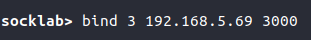

### Question 5

### Question 6
Il doit me fournir son adresse ip ainsi que son port de destination.

### Question 7

### Question 8 
Il est préférable de choisir le port sur la machine qui reçoit le message pour s'assurer que celui-ci soit libre et que tout les clients qui souhaitent communiquer avec cette machine utilisent ce port.

En revanche, il importe peu que l'on choisisse nous même le port de la machine cliente, puisque le serveur recevra le port source avec le message dans l'en-tête du datagramme.

### Question 9 
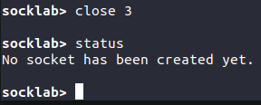

### Question 10
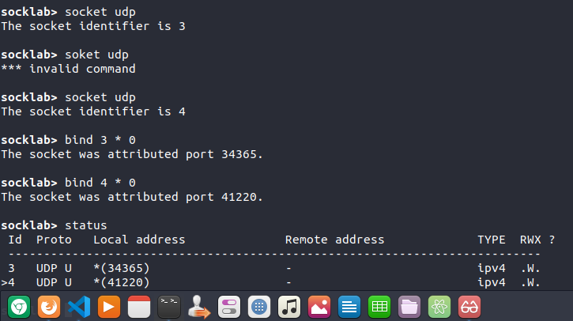

### Question 11
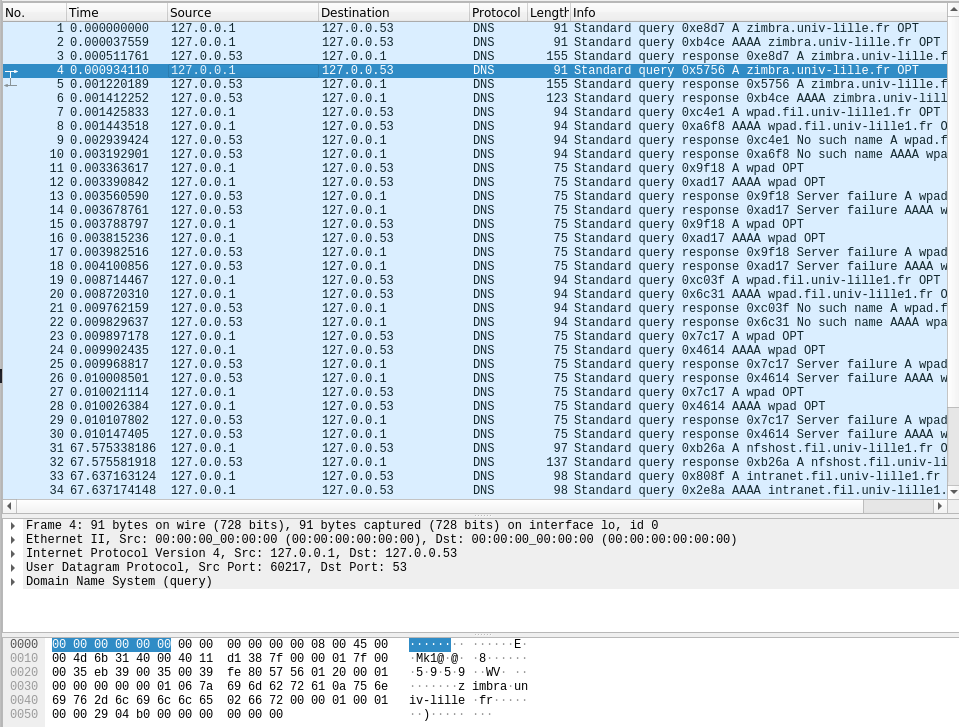

### Question 12
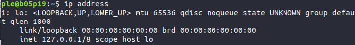

### Question 13
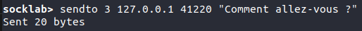

### Question 14
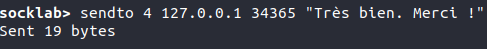 

### Question 15
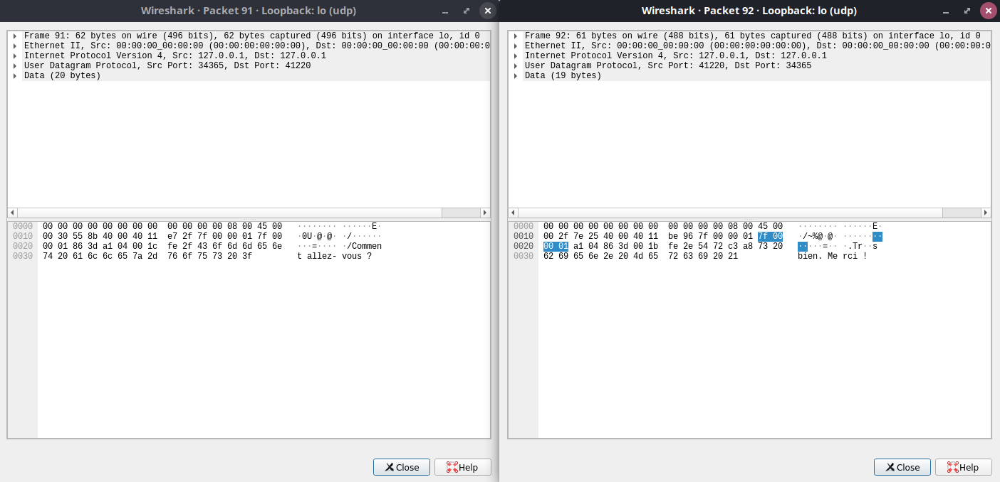 

a) Les adresses IP destination et sources ainsi que les ports sont corrects.

b) .png "diagramme")

c) Un segment UDP a été envoyé pour chaque message car les données de ces communications étaient très courtes.

d) Pour le message "Comment allez-vous ?" nous avons envoyé 20 octets de données et la trame avait une taille de 62 octets.

Pour le message "Très bien. Merci !" nous avons envoyé 19 octets de données et la trame avait une taille de 61 octets.

Il y a donc une différence de 42 octets entre le message envoyé et la trame complète.  

L'efficacité pour le premier message est de 20/62 = 32.25%.
L'efficacité pour le deuxième message est de 19/61 = 31.15%.

### Question 16

## TCP
### Question 1
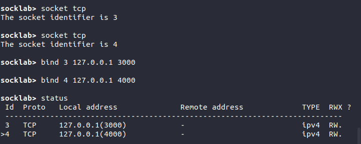

### Question 2
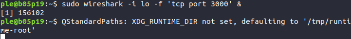

### Question 3
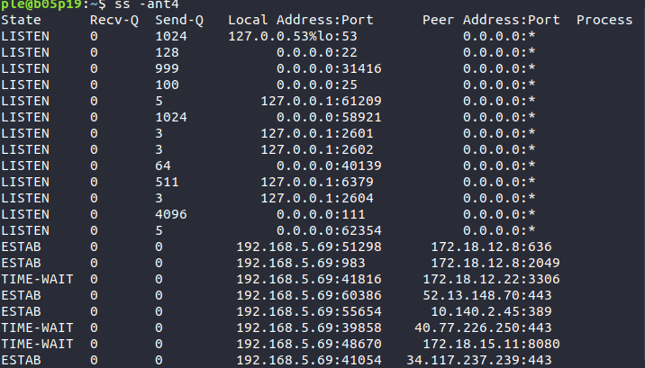

### Question 4
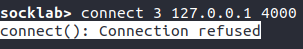

### Question 5

### Question 6 
La socket serveur est la socket qui écoute, soit S2 et la socket client est la socket S1 qui enverra des messages à S2.

### Question 7
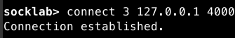
.png "sockets")

On constate sur wireshark que des échanges ont eu lieu sur la boucle locale entre le port 3000 et 4000 lors de la connexion entre les deux sockets.

### Question 8
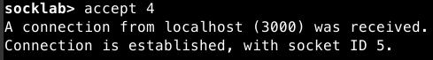

### Question 9
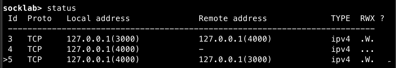

Une nouvelle ligne est apparue dans le tableau généré par la commande socket avec l'apparition d'une nouvelle socket qui a 5 pour identifiant. On voit grâce aux champs `local address`et `remote address` que cette socket fait le pont entre le port `4000` et le port `3000` de la boucle locale. On peut également noter que la socket d'identifiant 3 a également son champ `remote address` qui pointe vers le port `4000` de la boucle locale.

### Question 10
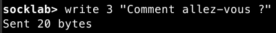

### Question 11
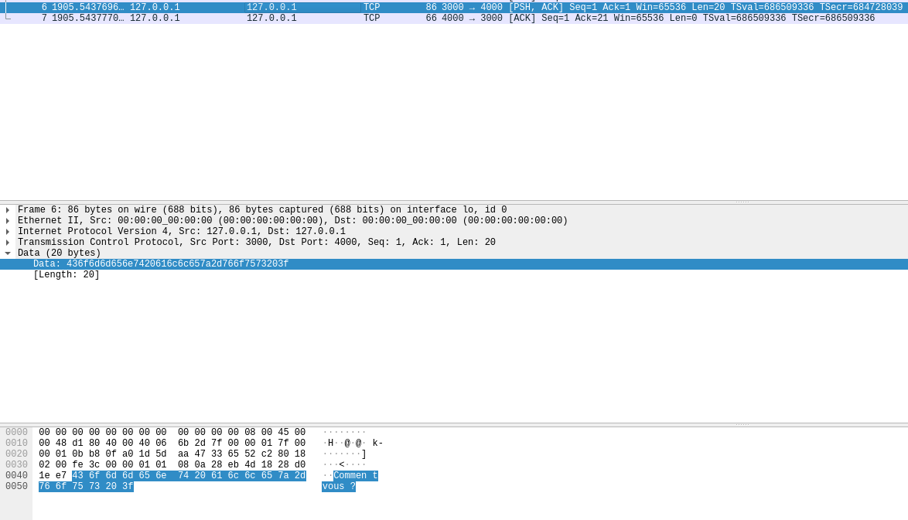

On observe que deux paquets ont été échangés sur wireshark.

a) Si le flag PSH n'avait pas été activé par l'émetteur, le paquet ne se serait pas envoyé immédiatement et le protocole TCP aurait attendu que d'autres données viennent remplir la place restante disponible dans le paquet pour optimiser la transmission. Ce flag permet de forcer l'envoi direct du paquet vers le destinataire.

b) Le numéro de séquence du segment envoyé correspond à l'indice du premier octet de donnée dans ce paquet sur toutes les données qui seront échangées durant cette communication

c) Le numéro d'acquittement du segment reçu correspond à l'indice du prochain octet qui devrait être envoyé.

d) `21 - 1 = 20` Le résultat correspond à la taille du message que nous avons envoyé : 20 octets.

### Question 12 
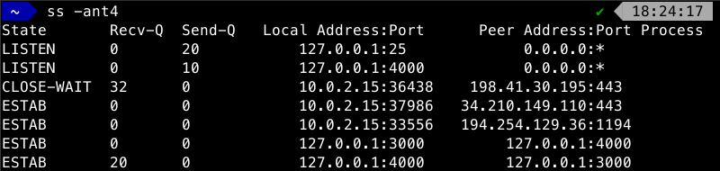

Le champ Recv-Q contient 20, c'est à dire le nombre d'octets transmis pendant la connexion précédente.

### Question 13
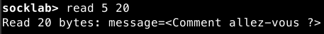

`id_socket` est l'identifiant renvoyé par la commande accept.

### Question 14

Le champ Recv-Q est désormais à 0. Les octets ont été lus et ne sont plus en attente.

### Question 15
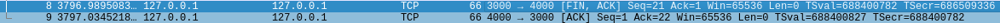

On voit que deux paquets ont de nouveau été échangé. Le premier contient le flag FIN et le deuxième est un acuquittement comme lors du premier mesage. Cette commande envoie donc un message au destinataire stipulant que la connexion est terminée.

.png "brokenPipe")

On ne peut pas envoyer un autre message sur cette socket car la connexion a été rompue.

### Question 16
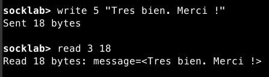

### Question 17
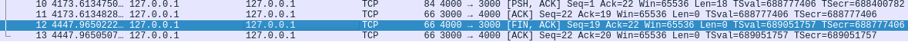

### Question 18
a) 
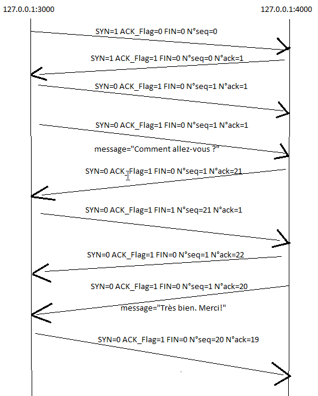

b) En tout, 9 segments TCP ont été transmis lors de la connexion et de l'envoi des messages. C'est quatre fois plus qu'en UDP.

c) Pour le message "Comment allez-vous ?" nous avons envoyé 20 octets de données et la trame avait une taille de 86 octets.

Pour le message "Très bien. Merci !" nous avons envoyé 18 octets de données et la trame avait une taille de 84 octets.

Il y a donc une différence de 66 octets entre le message envoyé et la trame complète.  

L'efficacité pour le premier message est de 20/86 = 23.26%.
L'efficacité pour le deuxième message est de 18/84 = 21.43%.

On perd 10% d'efficacité en utilisant le protocole TCP plutôt que le protocole UDP.

### Question 19

## Retransmissions
### Question 1
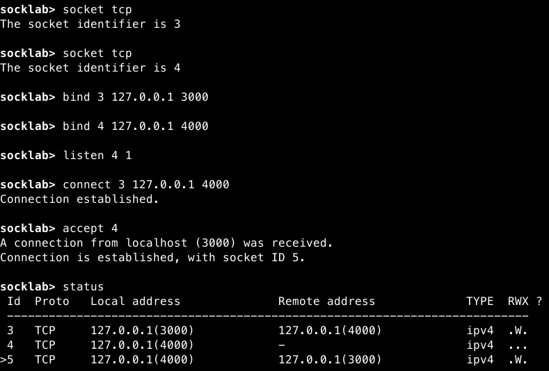

### Question 2
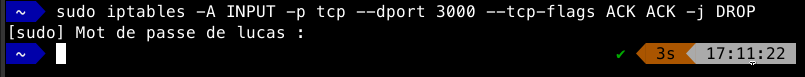

### Question 3
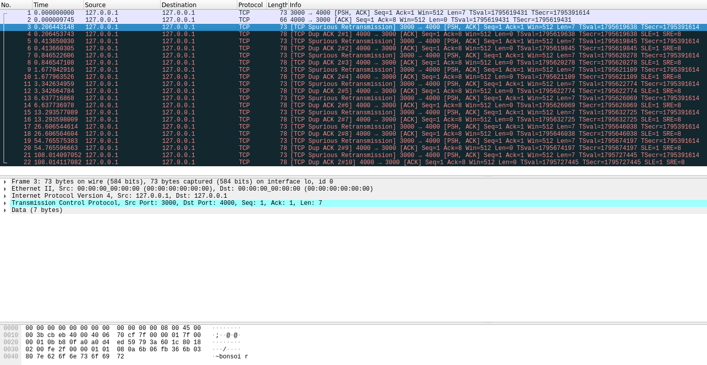

On constate que la socket continue d'envoyer le message en boucle, je pense que la commande précédente a modifié la table de routages pour uqe la socket client ne reçoive pas l'acquittement.

### Question 4
Rien n'a changé.

### Question 5
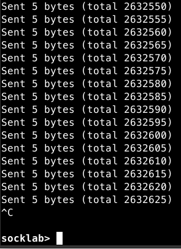

### Question 6
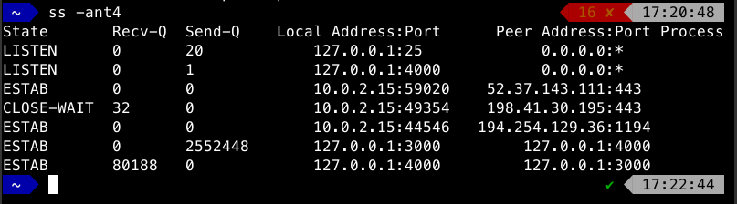

Je vois que les buffers de réception et d'émissions sont pleins et que de nombreux octets sont encore en attente de réception, car on n'a pas lu les valeurs.

### Question 7
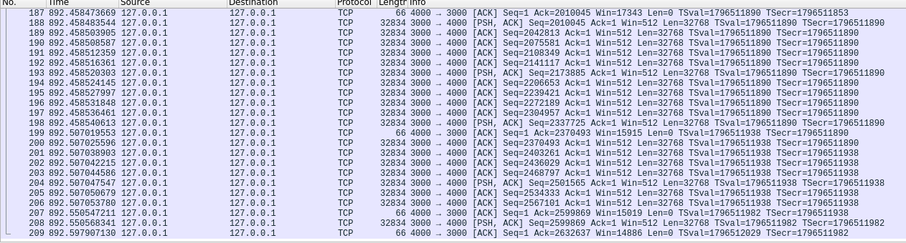

On voit sur wireshark que des segments TCP ont été envoyés pendant que je vidais le buffer de réception de la socket. Les messages étaient donc bien en attente pendant que les buffers étaient pleins. Ils ont été envoyés quand le buffer de réception avait suffisamment d'espace libre pour les recevoir.

### Question 8
a) Le destinataire envoie un acquittement comportant le flage `TCP ZeroWindow` lorsque son tampon est plein.

b) S1 attend une seconde avant d'envoyer de nouveau le prochain segment avec le flag `TCP KeepAlive`. Si le destinataire lui renvoie un acquittement `TCP ZeroWindow`, il recommence cette procédure. Tant qu'il n'a pas pu envoyer ce segment TCP, il ne va pas chercher à envoyer le prochain paquet. Le temps d'attente avant d'envoyer de nouveau le paquet est doublé à chaque acquittement `TCP ZeroWindow`

c) Lorsque le buffer de réception est vidé avec un read par exemple, le destinataire envoie un segment TCP d'acquittement contenant le flag `TCP Window Update`, signalant au destinataire que de la place s'est libéré dans le buffer de réception.

d) Le destinataire n'envoie pas systématiquement d'accusé de réception à chaque paquet reçu. Parfois, le destinataire envoie un paquet sans le flag `PSH` et le destinataire attend quelques paquets avant de recevoir un acquittement précisant qu'il a bien reçu un message de la longueur des 4 paquets en même temps.

e) La valeur du champs `Window` n'est pas constante. Elle varie en fonction de la taille des paquets reçus et de la façon dont est vidé le tampon de réception. Si de gros segments TCP sont envoyés sans qu'ils soient lus immédiatement, la taille de la fenêtre va diminuer jusqu'à ce que le tampon soit plein et que cette valeur soit de 0. C'est à ce moment là que le destinataire enverra un acquittement contenant le flag `TCP ZeroWindow`.

### Question 9
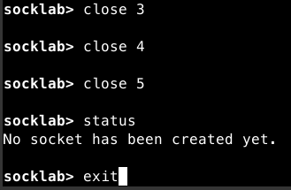