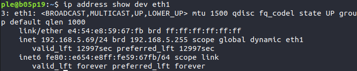
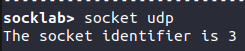
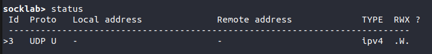

# Rapport pour le TP1

## UDP

### Question 1

L'adresse mac de l'interface est : `e4:54:e8:59:67:fb`

L'adresse ipV4 de la machine est : `192.168.5.69/24`

### Question 2
L'identifiant de la socket est 3

### Question 3

### Question 4
image

### Question 5
image

### Question 6
Il doit me fournir son adresse ip ainsi que son port de destination.

### Question 7
image

### Question 8 
