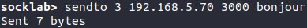
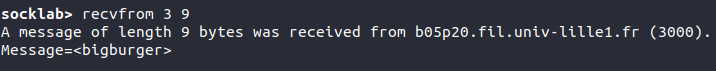
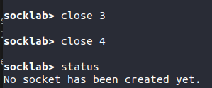
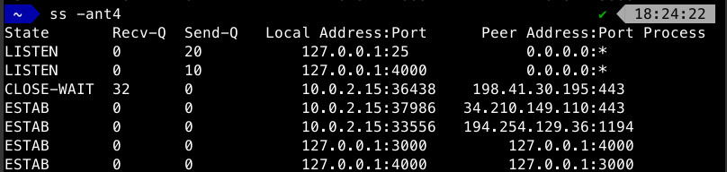

# Rapport pour le TP1

## UDP

### Question 1

L'adresse mac de l'interface est : `e4:54:e8:59:67:fb`

L'adresse ipV4 de la machine est : `192.168.5.69/24`

### Question 2
L'identifiant de la socket est 3

### Question 3

### Question 4

### Question 5

### Question 6
Il doit me fournir son adresse ip ainsi que son port de destination.

### Question 7

### Question 8 
Il est préférable de choisir le port sur la machine qui reçoit le message pour s'assurer que celui-ci soit libre et que tout les clients qui souhaitent communiquer avec cette machine utilisent ce port.

En revanche, il importe peu que l'on choisisse nous même le port de la machine cliente, puisque le serveur recevra le port source avec le message dans l'en-tête du datagramme.

### Question 9 

### Question 10

### Question 11

### Question 12

### Question 13

### Question 14
 

### Question 15
 

a) Les adresses IP destination et sources ainsi que les ports sont corrects.

b) .png "diagramme")

c) Un segment UDP a été envoyé pour chaque message car les données de ces communications étaient très courtes.

d) Pour le message "Comment allez-vous ?" nous avons envoyé 20 octets de données et la trame avait une taille de 62 octets.

Pour le message "Très bien. Merci !" nous avons envoyé 19 octets de données et la trame avat une taille de 61 octets.

Il y a donc une différence de 42 octets entre le message envoyé et la trame complète.  

L'efficacité pour le premier message est de 20/62 = 32.25%.
L'efficacité pour le deuxième message est de 19/61 = 31.15%.

### Question 16

## TCP
### Question 1

### Question 2

### Question 3

### Question 4

### Question 5

### Question 6 
La socket serveur est la socket qui écoute, soit S2 et la socket client est la socket S1 qui enverra des messages à S2.

### Question 7

.png "sockets")

On constate sur wireshark que des échanges ont eu lieu sur la boucle locale entre le port 3000 et 4000 lors de la connexion entre les deux sockets.

### Question 8

### Question 9

Une nouvelle ligne est apparue dans le tableau généré par la commande socket avec l'apparition d'une nouvelle socket qui a 5 pour identifiant. On voit grâce aux champs `local address`et `remote address` que cette socket fait le pont entre le port `4000` et le port `3000` de la boucle locale. On peut également noter que la socket d'identifiant 3 a également son champ `remote address` qui pointe vers le port `4000` de la boucle locale.

### Question 10

### Question 11

On observe que deux paquets ont été échangés sur wireshark.

a) Si le flag PSH n'avait pas été activé par l'émetteur, le paquet ne se serait pas envoyé immédiatement et le protocole TCP aurait attendu que d'autres données viennent remplir la place restante disponible dans le paquet pour optimiser la transmission. Ce flag permet de forcer l'envoi direct du paquet vers le destinataire.

b) Le numéro de séquence du segment envoyé correspond à l'indice du premier octet de donnée dans ce paquet sur toutes les données qui seront échangées durant cette communication

c) Le numéro d'acquittement du segment reçu correspond à l'indice du prochain octet qui devrait être envoyé.

d) `21 - 1 = 20` Le résultat correspond à la taille du message que nous avons envoyé : 20 octets.

### Question 12 

Le champ Recv-Q contient 20, c'est à dire le nombre d'octets transmis pendant la connexion précédente.

### Question 13

`id_socket` est l'identifiant renvoyé par la commande accept.

### Question 14

Le champ Recv-Q est désormais à 0. Les octets ont été lus et ne sont plus en attente.

### Question 15

On voit que deux paquets ont de nouveau été échangé. Le premier contient le flag FIN et le deuxième est un acuquittement comme lors du premier mesage. Cette commande envoie donc un message au destinataire stipulant que la connexion est terminée.

.png "brokenPipe")

On ne peut pas envoyer un autre message sur cette socket car la connexion a été rompue.

### Question 16

### Question 17

### Question 18
