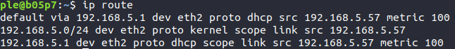
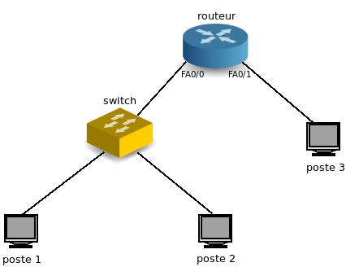

# Rapport pour le TP4 : Liaison de données


## Adressage

### (Réalisée sur une machine virtuelle à la maison)

1. Sur votre machine, quel est le nom de l’interface connectée au réseau de la salle de TP ? Quelle est son
adresse IPv4 ? Quelle est son adresse IPv6 ? Quelle est son adresse MAC ?

    J'ai éxecuté la commande suivante pour obtenir ces informations :

    ```bash
    ip address
    ```

    L'interface connectée au réseau est `enp0s3`.

    iPv4 : 10.0.2.15/24

    iPv6 : fe80::a00:27ff:fe96:5ed4/64

    MAC : 08:00:27:96:5e:d4

2. Donnez les principales caractéristiques de cette interface : quelle est sa vitesse actuelle ? Est-ce la vitesse
maximale supportée par l’interface ? Quel le mode de duplex ? Vérifiez que l’interface est bien
connectée.

    J'ai éxécuté la commande :
    ```bash
    sudo ethtool enp0s3
    ```

    Vitesse : 1000Mb/s. C'est la vitesse maximale supportée par l'interface.

    Mode de duplex : Full-duplex

    L'interface est bien connectée : on le voit à la ligne `Link detected : yes`

    

3. Quelle est la classe de l’adresse IPv4 ? Quel est son masque ? Quelle est l’adresse du réseau au format
CIDR ? Quelle est l’adresse de broadcast ? Combien d’hôtes peut-on adresser sur ce réseau ? Cette
adresse est-elle routable au sein d’un réseau local ? Est-elle routable sur internet ?

    L'adresse IPv4 est une adresse de classe A de masque 24 bits.

    Adrese réseau au format CDIR : 10.0.2.0/24
    Adresse de broadcoast : 10.0.2.255
    
    On peut adresser 254 machines sur ce réseau. Cette adresse est routable au sein d'un réseau local mais pas sur internet car il s'agit d'une adresse privée.

4. Écrivez les 16 octets de l’adresse IPv6 sans abréviation. Écrivez en dessous les 16 octets du masque.
Combien d’hôtes peut-on adresser sur ce réseau ? Cette adresse est-elle routable au sein d’un réseau
local ? Est-elle routable sur internet ? Quelle est l’étendue (scope) de cette adresse ?

    IPv6 :   fe80:0000:0000:0000:ee7b:bef7:0a0d:29f0/64

    Masque : ffff:ffff:ffff:ffff:0000:0000:0000:0000/64

    On peut adresser sur ce réseau `2^(128-64) - 2` machines, soit 18,446,744,073,709,551,614 machines.

    Cette adresse est utilisable dans un réseau local. Elle n'est pas routable sur internet mais uniquement sur un réseau local.
    C'est une adresse de lien local.

   Affichez la table de routage. Quelle est l’adresse de la passerelle IP ?

    J'ai éxecuté la commande `ip route` pour acéder à la table de routage.

    L'adresse de la passerelle IP semble être `10.135.4.1`

    

5. Avec Wireshark, lancez une capture de trames sur l’interface connectée au réseau de la salle de TP.
Testez la connectivité IPv4 et IPv6 avec votre voisin.

    J'ai exécuté la commande suivante pour ouvrir wireshark : `sudo wireshark -i enp0s3`

    Comme je travaille chez moi sur ma machine virtuelle, j'ai ping mon ordinateur qui a pour adresse privée 192.168.0.49.
    J'ai donc éxecuté `ping 192.168.0.49`. On voit sur wireshark les trames échangées par la commande ping mais aussi toutes les autres trames qui passent par l'interface `enp0s3`.

6. Arrêtez la capture . La transmission qui nous intéresse est noyée parmi d’autres trames qui nous
parasitent.
Pour simplifier la lecture, filtrez la capture de manière à ce que soient affichées uniquement les trames
émises par votre machine ou à destination de votre machine. Attention : les trames ethernet ne
contiennent pas toujours un paquet IP.
Pour savoir comment utiliser les filtres d’affichage, référez-vous à l’aide de Wireshark :
[https://www.wireshark.org/docs/wsug_html_chunked/ChWorkDisplayFilterSection.html](https://www.wireshark.org/docs/wsug_html_chunked/ChWorkDisplayFilterSection.html)

    Pour ne voir que les trames du ping, il faut filtrer les trames qui ont pour ip source l'ip de ma machine virtuelle (10.0.2.15) et pour ip de destination l'ip de mon ordinateur (192.168.0.49).

    L'expression s'écrit ainsi sur wireshark : `(ip.src == 10.0.2.15) && (ip.dst == 192.168.0.49)` pour voir les trames partant de la machine virtuelle ou `ip.src == 192.168.0.49) && (ip.dst == 10.0.2.15)` pour voir les trames réponses du ping envoyées par mon ordinateur.

    On voit mieux les trames correspondant au ping : 

    

    On voit bien que la machine essaie d'envoyer une trame de 98 octets vers la machine que l'on tente de ping. Si cette-dernière reçoit la trame, elle la renvoie avec un numéro de séquence incrémenté.

7. Quel est le protocole utilisé pour tester la connectivité IP ? Ce protocole est le couteau suisse d’IP. Il ne
sert pas seulement à tester la connectivité IP. Quel est le type et le code des messages de requête et de
réponse ?

    

    Le protocole utilisé est le protocole ICMP (Internet Control Message Protocol). Les messages de requête ont un type fixé à 8 (qui signifie que cette trame est une requête ping). Les messages de réponse ont un type fixé à 0. Le code est fixé à 0. 

8. La plupart des protocoles réseau permettent, dans l’entête, de spécifier quel est le type du contenu
véhiculé.
Donnez le code du contenu de la trame ethernet.
Donnez le code du contenu du paquet IP.

    Le type du contenu de la trame ethernet est un paquet IPv4.
    Le type du contenu du paquet IP est un datagramme ICPM.

   Les paquets IP transmis à votre voisin sont encapsulés dans des trames ethernet. Pour que ces trames parviennent à destination, il faut connaître l’adresse ethernet de votre voisin. Cette adresse est aussi appelée adresse matérielle ou adresse MAC (Media Access Control), ou encore adresse de couche liaison..

9. Avant l’envoi du ping IPv4, un échange de messages ARP (Address Resolution Protocol) a eu lieu. Quelle
est l’adresse matérielle de destination de la requête ? Que signifie cette adresse ? Quelle est la question
posée par la requête ?

    
    Avant l'envoi du ping IPv4, on voit effectivement un échange de messages ARP. Dans mon cas, cet échange est un peu particuilier : comme je réalise cette partie sur une machine virtuelle sous VirtualBox, l'adresse de destination de requête est l'adresse `10.0.2.2` et non l'adresse ip de mon smartphone `192.168.0.24`. L'adresse `10.0.2.2` représente la gateway de la machine virtuelle vers l'extérieur. Le message ARP est envoyé sur cette gateway.

    .png "ARP requête")

    L'adresse matérielle de destination de la requête est 00:00:00:00:00:00 (l'adresse ip est bien 10.0.2.2)
    Cette adresse est la gateway de la machine virtuelle vers l'extérieur.
    La question posée par la requête est "Qui a l'adresse 10.0.2.2 ?"


    Questions 10 et 11 réalisées en salle B05 (problème d'IPv6 sur ma machine virtuelle).

10. Avant l’envoi du ping IPv6, un échange de messages ICMPv6 de type Neighbor Solicitation et Neighbor
Advertisement a eu lieu. Quelle est l’adresse matérielle de destination de la requête ? Que signifie cette
adresse ? Quelle est l’adresse IP de destination de la requête ? A quoi correspond cette adresse ?
Mon adresse : fe80::e654:e8ff:fe59:7df7/64
Son adresse : fe80::e654:e8ff:fe59:6562/64

    **Remplacez cette phrase avec votre réponse.**

11. Affichez la liste des correspondances entre adresses IP et adresses ethernet. Vérifiez que l’adresse IPv4 et
l’adresse IPv6 de votre voisin y figurent, associées à son adresse MAC. Attention : les entrées de ce cache
ont une durée de vie limitée à quelques minutes.

    **Remplacez cette phrase avec votre réponse.**

12. A quelles couches du modèle OSI appartiennent les protocoles ethernet, IP, ICMP ?

    Le protocole ethernet appartient à la couche physique et liaison de données.
    Le protocole IP appartient à la couche réseau.
    Le protocole ICMP appartient également à la couche réseau.

13. Selon vous, de manière générale, pourquoi utilise-t-on l'adresse IP et non uniquement l'adresse MAC pour
les communications réseaux ?

    Les adresses MAC permettent de réaliser des communications au sein du réseau local car des équipements comme les switchs ne savent pas travailler au-delà de la couche liaison de données. Par contre, on ne peut pas utiliser seulement les adresses MAC pour toutes les communications réseaux. Il est possible qu'une autre carte réseau ait la même adresse MAC que la notre sur un réseau à l'autre bout du monde. C'est pour ça que l'on utilise également l'adresse IP, le tout épaulé par le protocole ARP. On peut alors avoir un identifiant unique avec l'adresse IP d'une adresse MAC sur le réseau. Une adresse IP accessible depuis internet (qui n'est donc pas privée) est unique alors que les adresses MAC ne le sont pas forcément. C'est pour ça qu'on utilise plus l'adresse IP pour les communications réseaux en général.

## Point-à-point

Chaque machine de la salle dispose d’au moins 2 interfaces ethernet. Laissez votre machine connectée à la prise EXT, qui vous permet d’atteindre internet ou votre homedir. Utilisez une autre interface ethernet pour la connecter à la machine de votre voisin, en point-à-point, via la
baie de brassage.

1. Vous utilisez un câble droit ou un câble croisé ?

    On utilise un câble croisé sur la baie et un câble droit vers la prise murale.

2. Quelle commande utilisez-vous pour vérifier que votre interface est bien connectée, et connaître la vitesse
et le mode de duplex qui ont été négociés entre vos deux machines ?

    On exécute la commande suivante :
    ```bash
    sudo ethtool eth1
    ```
    
    Vitesse : 1000Mb/s max

    Mode de duplex : Full-duplex

    On peut voir toutes les informations de cette interface réseau sur la capture d'écran suivante.
    

3. Affectez une adresse IPv4 privée de classe A à l’interface ethernet. Notez qu’une adresse IPv6 est déjà
associée à cette interface. Elle a été configurée automatiquement.

    Vous remarquerez qu’une même interface réseau peut très bien être associée à plusieurs adresses IP.

    On exécute la commande suivante pour affecter à l'interface `eth1` l'adresse iPv4 `10.2.0.1/8` :

    ```bash
    sudo ip address add 10.2.0.1/8 dev eth1
    ```

    

4. Affichez la table de routage. Que constatez-vous ?

    Pour afficher la table de routage, on exécute cette commande :
    ```bash
    ip route
    ```

    

    Je constate qu'il n'y a pas d'entrées dans la table de routage utilisant cette interface. Les entrées présentes concernent l'interface `eth2` qui est l'interface connectée vers l'extérieur.

5. Testez la connectivité avec votre voisin.

    Je teste la connectivité avec mon voisin avec la commande `ping` et son interface est configurée avec l'adresse `10.2.0.2`

    ```bash
    ping 10.2.0.2
    ```

    

    Le ping fonctionne entre les deux machines connectées point à point.

## Concentrateur (hub)

Brassez votre poste de travail sur le concentrateur (hub) situé dans la baie de brassage.
Assurez-vous que deux de vos voisins y sont connectés également.
Supprimez les filtres de capture et d'affichage préalablement configurés.

1. Lancez une capture de trames sur un poste, et transmettez un ping entre les deux autres postes. Que
constatez-vous ? Déduisez-en la manière dont les données sont transmises par cet équipement. Les
données émises par un poste sont-elles reçues par ce même poste ?

    

    Nous n'étions que deux connectés sur le hub au moment de la capture d'écran. On voit ici le ping entre ma machine et celle de mon voisin. Cependant lorsque d'autres personnes se sont connectés au hub, nous avons bien remarqué que tout le monde peut voir les requêtes et réponses ping qui passent dans le hub. Il est possible de ping n'importe qui tant que cette personne est connectée sur le hub. 

    On déduit que les données transmises via le hub sont redirigées vers tous les ports du hub : c'est pour cela que tout le monde peut voir sur son interface les requêtes liées au différents ping.

    On voit sur la capture d'écran que l'on ne reçoit ce que l'on émet, sinon cela apparaîterai en double sur wireshark (on aurait la capture lors de l'émission depuis l'interface ainsi que de la réception de la même requête depuis le hub). 

2. Recommencez la manipulation en désactivant le mode promiscuous de wireshark. A quoi sert-il ?

    Il sert à afficher seulement les requêtes qui arrive sur la carte réseau et pas tout ce qui arrive sur le réseau.
    On ne voit que les pings concernant l'interface de mon poste.

3. Quel est le mode de duplex des interfaces connectées au hub ? Quelle en est la signification ?

    Le mode de duplex des interfaces connectées au hub est Half-duplex. Cela signifie que la communication entre l'interface et le hub peut se faire dans les deux sens, mais pas simultanément.

4. Quelles sont les topologies physique et logique du réseau constitué par le concentrateur et les postes qui y sont connectés ?

    La topologie du réseau constitué par un hub et les postes connectés est une topologie en étoile.

5. Lancez la commande « iperf -s » sur un poste et « iperf -c ip_du_serveur » sur un autre poste pour lancer
un test de bande passante. Notez le débit atteint et les valeurs du compteur de collisions (voir annexe)
avant et après la manipulation.
Connectez un poste supplémentaire sur le hub (soit au minimum 4 postes) et réalisez de nouveau la manip
en parallèle sur les deux paires de postes.
Notez le débit atteint et les nouvelles valeurs des compteurs de collisions. Déduisez-en la manière dont
fonctionne un hub.

   Les postes connectés entre eux via des concentrateurs forment un **domaine de collision**.

    Lors de la réalisation de cette manipulation, j'étais le poste qui exécutait la commande :
    ```bash
    iperf -s
    ```
    C'est donc moi qui recevait les connexions des autres postes.

    Sur cette première capture d'écran, on peut voir que l'on a d'abord réalisé un essai avec une seule connexion pour voir le débit puis nous avons réalisé la manipulation avec 2 postes qui se connectent simultanément.
   .png "iperf mode serveur")   
   On voit déjà que le débit a été divisé par deux ce qui montre bien que la communication est affectée lorsque deux postes échangent simultanément avec le même poste.

   Observons les collisions en regardant les informations générales de l'interface connectée :

    ```bash
    ifconfig
    ```

   .png "collisions avant connexion")    
   182 collisions avant manipulation

   .png "collisions après connexion")
    682 après manipulation avec deux connections simultanées

    On voit ici que des collisions supplémentaires ont été détectées ce qui explique pourquoi le débit a été largement réduit. 

## Commutateur (switch)

Brassez votre poste de travail sur le commutateur (switch) situé dans la baie de brassage.
Assurez-vous que deux de vos voisins y sont connectés également.
Supprimez les filtres de capture et d'affichage préalablement configurés.
Réactivez le mode promiscuous.

1. Lancez une capture de trames sur un poste, et transmettez un ping entre les deux autres postes. Que
constatez-vous ? Déduisez-en la manière dont les données sont transmises par cet équipement.

    Cette capture de trames a été réalisé sur le poste qui envoie le ping.
    .png "capture de trames pc qui ping")

    Cette capture de trames a été réalisé sur le poste qui reçoit le ping.
    .png "capture de trames pc qui reçoit le ping")

    On voit bien que les postes concernés par le ping reçoivent sur leur interface les messages de ce ping ainsi que les messages ARP.

    Cette capture de trames a été réalisé sur un autre pc connecté au switch.
    .png "capture de trames autre pc connecté au switch")
    
    Contrairement au hub, un poste également connecté au switch mais qui n'est pas concerné par un ping ne va pas voir ces échanges, il verra simplement les requêtes ARP qui sont diffusées en broadcast sur le réseau du switch.


2. Quel est le mode de duplex des interfaces connectées au hub ? Quelle en est la signification ?

    On exécute une nouvelle fois la commande suivante pour voir les informations de l'interface :
    ```bash 
    sudo ethtool eth1
    ```

    

    Le mode de duplex est Full-Duplex, cela signifie que la communication est possible dans les deux sens simultanément.

3. Quelles sont les topologies physique et logique du réseau constitué par le concentrateur et les postes qui y sont connectés ?

    La topologie du réseau constitué par un switch et les postes connectés est une topologie en étoile.

4. Lancez la commande « iperf -s » sur un poste et « iperf -c ip_du_serveur » sur un autre poste pour lancer
un test de bande passante. Notez le débit atteint et les valeurs du compteur de collisions (voir annexe)
avant et après la manipulation.
Connectez un poste supplémentaire sur le switch (soit au minimum 4 postes) et réalisez de nouveau la
manip en parallèle sur les deux paires de postes.
Notez le débit atteint et les nouvelles valeurs des compteurs de collisions. Déduisez-en la manière dont
fonctionne un switch.

    Comme pour les hubs, j'étais un des postes qui faisait office de serveur sur le réseau. 

    On voit qu'avant la manipulation, le nombre de collisions était nul sur l'interface.
    .png "collisions avant connexion")

    Les deux captures d'écrans suivantes montrent une connexion sur le serveur de mon poste ainsi qu'une connexion de mon poste vers un serveur sur un autre poste. Ces connexions ont été réalisé simultanément.
    .png "iperf serveur")

    .png "iperf connexion")

    On voit sur cette capture d'écran qu'après les connexions, il n'y a pas eu de collisions au niveau de l'interface du poste, contrairement au hub.
    .png "collisions après connexions")

    Cela signifie que sur un switch, les informations sont transmises port à port mais, grâce au full duplex, il n'y a aucune collisions au niveau de l'interface et le débit reste bon.

    Pour paramétrer les équipements réseau et obtenir des informations sur leur configuration, il faut établir une
liaison série entre votre poste de travail et le port console de l'équipement en question.
Cette liaison permet d'établir une connexion dite « hors bande », c'est-à-dire en dehors de la bande passante
du réseau ethernet.
Connectez-vous sur le port console d'un switch, noté Sx-C (avec x=R,J,B ou V selon votre baie de brassage).
Utilisez pour cela un câble série DB9-RJ45 (câble bleu et plat) et lancez le programme « minicom ».

    Une fois connecté, tapez sur la touche « entrée » pour afficher le prompt. Si la question « voulez-vous lancer
le setup du switch ? » vous est posée, répondez « non ».
Vous êtes actuellement en mode USER EXEC (prompt >), qui ne permet de lancer qu'un nombre réduit de
commandes, que vous pouvez lister en tapant « ? ». Passez en mode privilégié (prompt #), puis affichez la
table de commutation.

5. Comparez les adresses MAC listées avec celles de vos postes et les ports du switch sur lesquels ils sont
connectés. Comment le switch a-t-il obtenu ces adresses ? Quel est le rôle de la table de commutation
(appelée aussi table d'adresses MAC) ?

    Voici les branchements réalisés au niveau du switch. Nos postes sont les 3 branchés sur la rangée la plus en haut. La prise avec le bout jaune est celle connectée sur un port SJ-C et les captures d'écrans proviennent de ce poste.
    .jpg "branchements sur le switch ")

    On voit sur la capture suivante 3 adresses MAC connectés sur certains ports. Ce sont effectivement les adresses MAC de nos interfaces réseau (par exemple, la mienne était 30b5.c204.a77d).

    .png "table de commutation")

    Le switch a obtenu ces adresss MAC lorsque les différentes interfaces ont communiqué via le switch. Ce-dernier va enregistrer ces adresses MAC dans la table de commutation pour les reconnaître, tant qu'elles sont branchées.

6. Pour fonctionner correctement, le switch a-t-il besoin de connaître les adresses mac des trames ? les
adresses IP des paquets ? Déduisez-en à quels niveaux du modèle OSI interviennent un switch et un hub
et quelles sont les unités de données sur lesquelles ils agissent.

    Le switch a besoin de connaître les adresses MAC des trames puisque la table de commutation ne comprend que les adresses MAC. Les switchs et les hubs fonctionnent donc sur la couche liaison.

7. Concluez sur les avantages du switch par rapport au hub.

    Un switch fonctionne comme un hub sur la même couche du modèle OSI. Cependant, il permet d'éviter les problèmes de collisions liés au mode de duplex du hub. Avec le full-duplex, les communications sont plus simples et on a également observé un débit bien plus élevé lors des connexions `iperf` sur le switch que sur le hub.

8. Selon vous, en fonctionnement normal, une interface d’un commutateur peut-elle être associée au même
moment à plusieurs addresses ethernet ? Une même adresse ethernet peut-elle être associée au même
moment à plusieurs interfaces d’un commutateur ?

     Je pense que l'on peut associer plusieurs adresses à une interface, mais pas une adresse à plusieurs interfaces en même temps.

9. Lancez maintenant une capture de trames sur plusieurs postes connectés au switch et transmettez un ping
vers l'adresse IP 255.255.255.255. Que constatez-vous ? Comment s'appelle ce type de transfert ? Quelle
est l'adresse ethernet de destination des trames reçues ?

    On exécute la commande suivante pour ping le broadcast du réseau.
    .png "ping sur le broadcast")

    Sur la capture, on voit bien que mon poste émet un ping sur le broadcast et que les deux autres postes connectés répondent à ce ping. 
    .png "capture de trames broadcast")

    L'adresse ethernet de destination des réponses est celle de mon poste, l'émetteur de la requête ping.

10. Envoyez un ping vers l’adresse ff02::1. Que constatez-vous ? Comment s'appelle ce type de transfert ?
Quelle est l'adresse ethernet de destination des trames reçues ?

    Le protocole utilisé ici est le `ICMPv6`, la même chose que pour les pings iPv4 mais pour des adresses iPv6.
    

    L'adresse des trames reçues est, comme pour les ping en iPv4, l'adresse iPv6 de l'interface de mon poste qui est l'émetteur du ping.

    Un commutateur permet de segmenter les domaines de collisions.
Les postes connectés par l'intermédiaire de commutateurs constituent un **domaine de broadcast**.


## Routeur

Choisissez 2 sous-réseaux IPv4 de classe B. Veillez à ce qu’ils soient différents de votre voisin.
Complétez le schéma suivant en affectant une adresse IP aux interfaces, l’objectif étant que les postes
puissent communiquer ensemble.



Connectez 3 postes, 1 switch et 1 routeur en suivant ce schéma.

1. Configurez les adresses IP sur les interfaces en vous référant à l’annexe.

    Sous-réseau 1 : 128.10.0.0/16.

    Sous-réseau 2 : 128.11.0.0/16.

    

    L'interface 0/0 du routeur est celle où est branché le switch reliant le poste 1 et le poste 2. L'interface 0/1 correspond à la liaison entre le poste 3 et le switch. La capture d'écran ci-dessus montre la configuration du routeur pour ces deux sous-réseaux.

2. Ajoutez une route sur les postes de manière à ce que les postes 1 et 2 puissent communiquer avec le 3.

    
    
    On considérera dans la suite de ce rapport que le poste que j'utilise ici est le poste 1 sur la topologie.

    On ajoute ici une route à la table de routage de l'interface reliée au routeur (ici eth0) précisant que pour une adresse IP correspondant au deuxième sous-réseau (aka celui du poste 3) il faut passer par une passerelle qui n'est autre que l'interface du routeur accesible dans le sous réseau du poste 1 et du poste 2.

3. Après avoir lancé une capture de trames sur les postes 2 et 3, lancez un ping depuis le poste 1 vers le
poste 2, puis vers le poste 3 (voir schéma). Il s'agit d'un transfert unicast. Comparez les valeurs du champ
TTL de l'entête IP des paquets reçus sur les postes 2 et 3. Pourquoi sont-elles différentes ? Quelle est
l'utilité de ce champ ?

    Cette capture est l'entête IP d'un paquet reçu lors d'un ping entre le poste 1 et le poste 2. On voit que le champs TTL (Time To Live) vaut 64.
    .png)

    Cette capture est l'entête IP d'un paquet reçu par le poste 3 lors d'un ping du poste 1 vers le poste 3. Le champs TTL vaut ici 63.
    .png)

    Ces valeurs sont différentes car lors d'un ping entre P1 et P2, le paquet passe par le switch et est directement envoyé sur le port où est branché P2. Lorsque P1 ping P3, le paquet doit sortir du sous-réseau et passer par le routeur pour être redirigé vers l'autre sous-réseaux où se trouve P3. C'est à ce moment là que la valeur du champs TTL est décrémentée.

    Ce champ exprime donc le nombre maximum de routeurs que le paquet IP peut traverser avant de ne plus être valide. 

4. Quelle devrait être la valeur du TTL pour que le poste 1 puisse communiquer avec le poste 2, mais pas
avec le poste 3 ? Vérifiez votre réponse en envoyant, depuis le poste 1, un ping avec ce TTL vers les
postes 2 et 3 (voir « man ping »).
Lancez une capture sur le poste 1 et envoyez un ping du poste 1 vers le poste 3 en conservant le TTL que
vous avez choisi. Que se passe-t-il ?

    .png "ping vers P2 et P3 avec un TTL fixé à 1")

    .png "capture de trames lors du ping vers P3 avec TTL à 1")

    Grâce à l'option `-t` de ping, on peut définir nous-même le TTL qui est de base fixé à 64. On le définit ici à 1 et on voit que lorsque P1 ping P2 tout va bien, mais lorsque l'on essaie de ping P3, la requête n'aboutit pas. On voit le message "Time to live exceeded" que ce soit dans le terminal ou sur la capture. En effet avec un TTL à 1 lors du ping, il faut passer par le routeur pour atteindre P3 et donc voir le TTL se décrémenter. Le fait qu'il arrive à 0 donne la mort du signal et il ne peut pas aller plus loin, c'est pour ça que P3 ne recevra jamais ce ping. 

5. Lancez de nouveau un ping depuis le poste 1 vers le poste 3. Quelles sont l'adresse MAC source de la
trame reçue (sur le poste 3) et l'adresse MAC de destination de la trame envoyée (à partir du poste 1) ?
Selon vous, à quelles interfaces ethernet correspondent ces adresses ? Pour vous aider, lancez la
commande « show interface fastethernet » sur le routeur.

    Cette capture montre les adresses MAC source et destination de la trame envoyée à partir du poste 1.
    .png "paquet envoyé par P1 vers P3")
    L'adresse MAC source est l'adresse MAC de l'interface eth0 du poste 1 et son adresse de destination est la passerelle définit dans la table de routage, soit l'interface du routeur associée au sous-réseau de P1 et P2.

    Cette capture montre les adresses MAC source et destination de la trame reçue à partir du poste 3.
    .png "paquet reçu par P3 de P1")
    L'adresse MAC source est l'adresse MAC de l'interface du routeur liée au sous-réseau de P3. Son adresse de destination est l'adresse MAC de l'interface connectée au routeur du poste 3.


6. Comment le poste 1 a-t-il su que la trame ethernet contenant le paquet IP à destination du poste 3 devait
être envoyée au routeur ?

    Avec la route ajoutée à la table de routage (le routeur est la passerelle pour une trame allant vers le sous-réseau 128.11.0.0). 

7. Dessinez un schéma des couches OSI utilisées dans chaque équipement mis en jeu dans le transfert
unicast (2 postes, 1 switch et 1 routeur), et tracez une ligne représentant le flux de données passant d'un
équipement à l'autre (communication horizontale) en traversant les couches (communication verticale).

    

8. Lancez une capture de trames sur les 3 postes et lancez un ping depuis le poste 1 vers l'adresse
255.255.255.255. Il s'agit d'un transfert en diffusion limitée (broadcast). Que constatez-vous ?

    

    Je constate que lorsque P1 ping en broadcast, il obtient une réponse de P2 et de l'interface du routeur mais pas de P3. De plus, sur la capture de trames de P3, aucune requête ping n'apparaissait.


9. Lancez une capture de trames sur les 3 postes et lancez un ping depuis le poste 3 vers l'adresse de
broadcast du réseau sur lequel se trouvent les postes 1 et 2. Que constatez-vous ?

    
    A l'inverse de la question précédente, lorsque P3 ping en broadcast sur le réseau de P1 et P2, il n'obtient une réponse que de l'interface du routeur qui correspond à son sous-réseau. P1 et P2 ne voient aucune trace de ces trames sur leur interface respectives.

    Exécutez les commandes suivantes sur le routeur : <br>
    _Router(config)#interface fastEthernet 0/0_ <br>
    _Router(config-if)#ip directed-broadcast_

10. Recommencez la manipulation précédente. Il s'agit d'un transfert en diffusion dirigée. Que constatez-
vous ? Quelle est l'adresse IP de destination des paquets reçus ? Selon vous, pourquoi ce mode de
transfert est-il désactivé par défaut ?

    On voit sur la capture de trames lors du broadcast de P1 comme précédemment que P2 et l'interface du routeur répond à ce ping en broadcast. On ne voit pas P3.
    .png "broadcast de P1")

    C'est ici que les choses changent. On voit que P3 capte des réponses au ping provenant de P1.
    .png "broadcast de P1")

    Ce mode est désactivé par défaut car, à présent, P3 peut directement voir les adresses IP de P1 et P2. Cela créerait des problèmes de sécurité puisque P3 n'appartient pas à ce réseau et peut donc lancer facilement des attaques sur ces postes.


11. Quelle est la différence entre diffusion limitée, diffusion dirigée et unicast.

    La diffusion limitée correspond à un mode de diffusion où le routeur ne laisse pas passer le broadcast au-delà du réseau local.

    La diffusion dirigée correspond à un mode de diffusion où le routeur ne laisse pas passer le broadcast au-delà du réseau, qui n'est plus nécessairement local.

    L'unicast est un mode de diffusion où la communication se fait entre deux appareils, qu'ils soient dans le même réseau ou pas.

12. Comment un routeur réagit à ces différents types de paquets ? Concluez sur la différence entre un routeur
et un switch vis-à-vis de la diffusion IP.

    Le routeur ne laisse pas passer les trames au-delà du réseau local dans le cas de la diffusion limitée, il les diffuse dans tout le réseau dans le cas de la diffusion dirigée et il les redirige vers le bon hôte/la bonne passerelle dans le cas de l'unicast.

    Un routeur est plus intelligent qu'un switch car il ne va pas forcément rediriger toutes les trames provenant d'un poste vers tout ses ports. C'est configurable.

13. Reliez votre routeur à celui de votre voisin de manière à ce que touts les machines puissent communiquer
ensemble.

    

    Ce schéma montre ici deux installations comme décrites dans la topologie de ce TP. Pour que toutes les machines puissent communiquer, il faut relier les deux routeurs entre eux par un câble croisé puis il suffit de configurer correctement les différentes routes des interfaces concernées pour les 2 routeurs et tous les postes. Une fois que les passerelles seront correctement définies et les adresses IP correctement configurées, toutes les machines de ce montage pourront communiquer entre elles via les routeurs liés entre eux.
